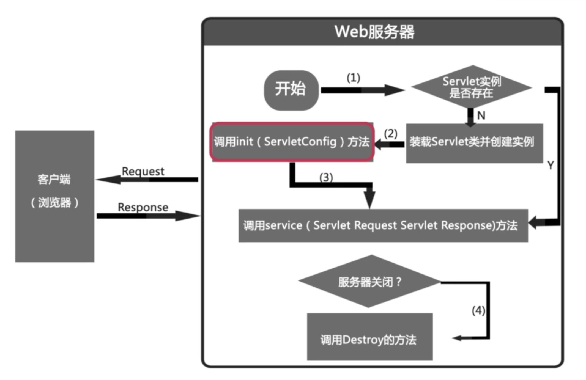

### Servlet基础
#### 1. 什么是Servlet?
> 问题:先有jsp还是先有Servlet?

答:先有Servlet,因为jsp的前身就是Servlet
Servlet是在服务器端运行的小程序,一个servelet就是一个java类,并且可以通过"请求-响应"编程模式来访问这个驻留在内存里的Servlet程序

#### 2.Tomcat容器等级
Tomcat容器分为四个等级,Servlet的容器管理Context容器,一个Context对应一个web工程


#### 3.手工编写第一个servlet
1. 继承HttpServlet


2. 重写doGet()或者doPost()方法
3. 在web.xml中注册Servlet
#### 4.使用IDEA编写servlet
1. src -> new -> servlet
2. 重写doGet() 或者 doPost()
3. 部署运行
> Get方式请求HelloServlet ->        < a href="servlet/HelloServlet">
#### 5.servlet的生命周期
1. 初始化阶段,调用init(ServletConfig)方法 
2. 加载和实例化阶段,响应客户端请求阶段,调用service()方法,由service()方法根据提交方式选择doGet() 或者 doPost()方法
```
☆ 在下列时刻Servlet容器装载Servlet:
一.Servlet容器启动时装载某些Servlet,实现它只需要在web.xml文件中<servlet></servlet> 之间添加如下代码:<load-on-startup>1</load-on-startup>
数字越小,表示优先级别越高
二.在Servlet容器启动后,客户端首次向Servlet发送请求
三.Servlet类文件被更新后,重新装载Servlet
四.Servlet被装载后,Servlet容器创建一个Servlets实例并调用Servlet的init()方法进行初始化.在整个Servlet生命周期中,init()只会被调用一次
```
3. 服务和销毁,调用destory()方法

#### 6.servlet获取九大内置对象
 
jSP对象     | 怎样获得
-------- | ---
out | rsp.getWriter
request    | Service方法中的req参数
response     | Service方法中的resp参数
session     | resp.getSession()函数
application     | getServletContext()函数
exception     | Throwable
page     | this
pageContext     | pageContext
Config     | getServletConfig


#### 7.servlet与表单
> servlet如何获取表单数据?reg.jsp
                  userinfo.jsp
#### 8.servlet路径跳转
- **绝对路径:** 放之四海皆标准的路径
- **相对路径:** 相对于当前资源的路径
#### 9.project
##### 使用servlet实现用户登录的小案例
> 用户名admin,密码admin.登陆成功使用服务器内部转发到login_success.jsp页面,并且提示登录成功的用户名,如果登录失败,则请求重定向到login_failure.jsp页面

#### Servlet高级
1. 获取初始化参数

在web.xml中配置Servlet时,可以配置一些初始化参数.
而在Servlet中可以通过ServletConfig接口提供的方法取得这些参数

2. MVC设计模式

MVC设计模式:MVC(Model,View,Controller),是软件开发过程中比较流行的设计思想,旨在f分离模型,控制,视图,是一种分层思想

3. Model2简介

java Web的Model2开发模式就是MVC思想的体现

4. 阶段项目

MVC模型实现(Jsp + Servlet + dao)

- 创建购物车类
- 编写购物车类
- 创建页面层
A 购物车cart的设计
* 添加
* 删除
* 计算总金额

使用servelet技术实现购物车的效果

